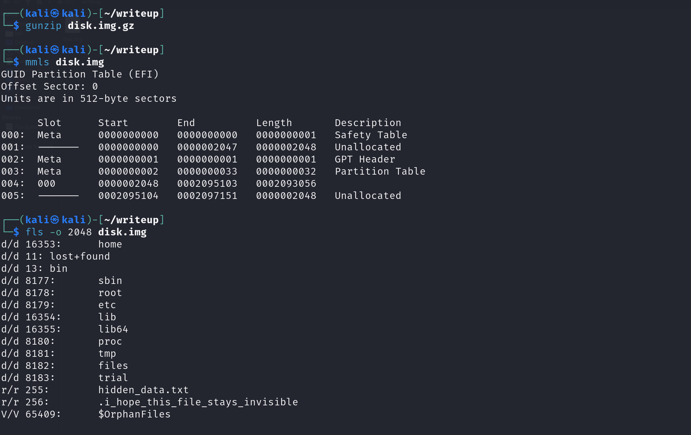
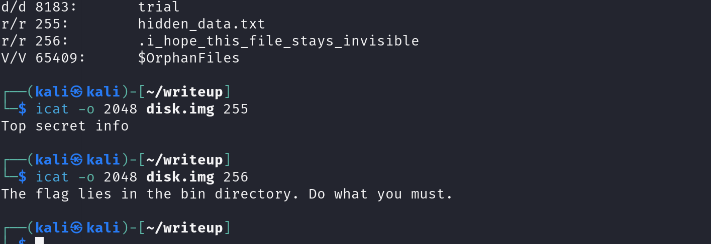
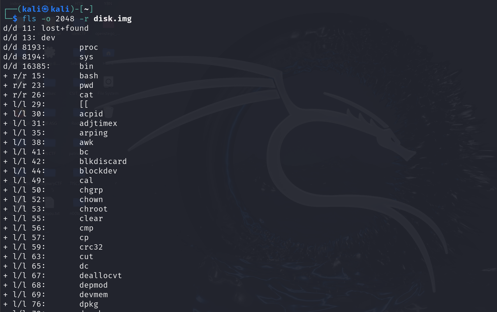
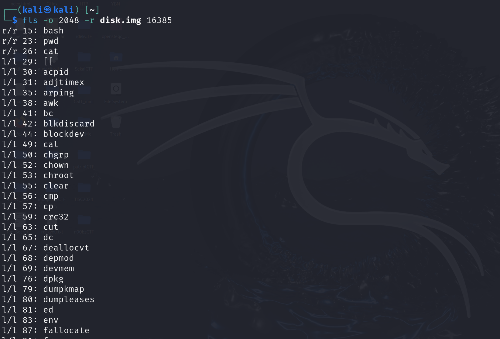
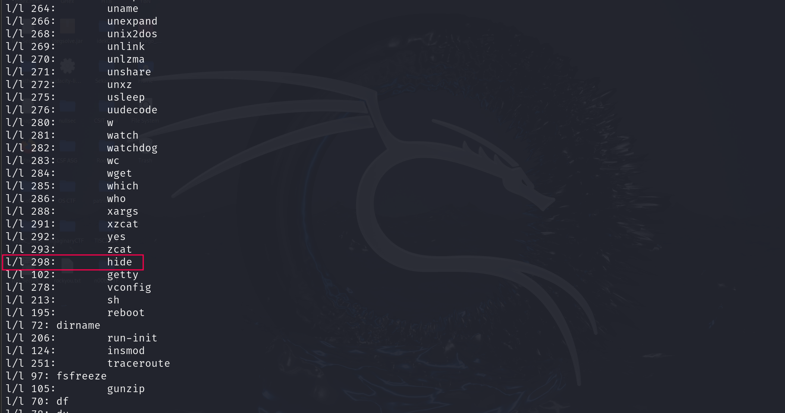
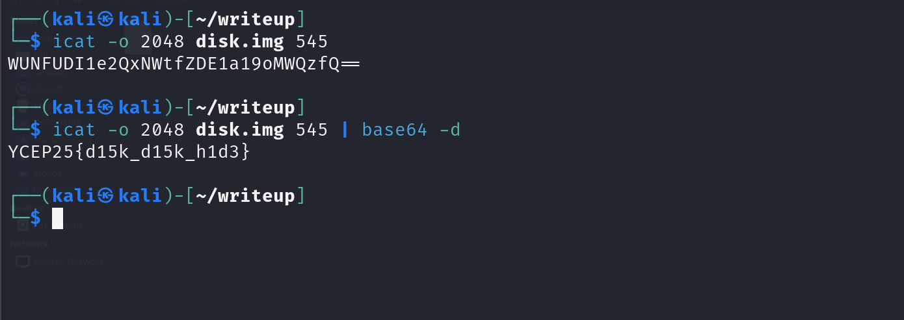

## Stealth Mode Activated

Participants are given a disk image file `disk.image.gz`.

To begin, we need to decompress the gzip file. Next, run `mmls` and `fls` to have a high-level understanding of the disk contents.

Doing this will reveal 2 files that are of interest, `hidden_data.txt` and `.i_hope_this_file_stays_invisible`.

By using `icat` to display the contents of the 2 respective files, we now know that the flag is within the `bin` directory in the file system.

If we display the contents of the file system using the `fls` command with the `-r` flag, we should see a whole bunch of items within the separate directories, including `bin`.

Notice that the inode number for the `bin` directory is 16385.

By specifying the inode number (16385), we can display only the contents of the `bin` directory. Within this directory, we can see that this directory contains many of the common commands used in Linux CLI.

Scrolling through the content, we can see that there's a file called "hide". This should raise suspicions as there is no such command in Linux.

We should note down the inode number of the "hide" file (`298`).

Now, using the found inode number, we can display the contents of this file. It should reveal a base64 encoded string. This can be decoded using `base64 -d` or other similar methods.

Decoded flag: `YCEP25{d15k_d15k_h1d3}`