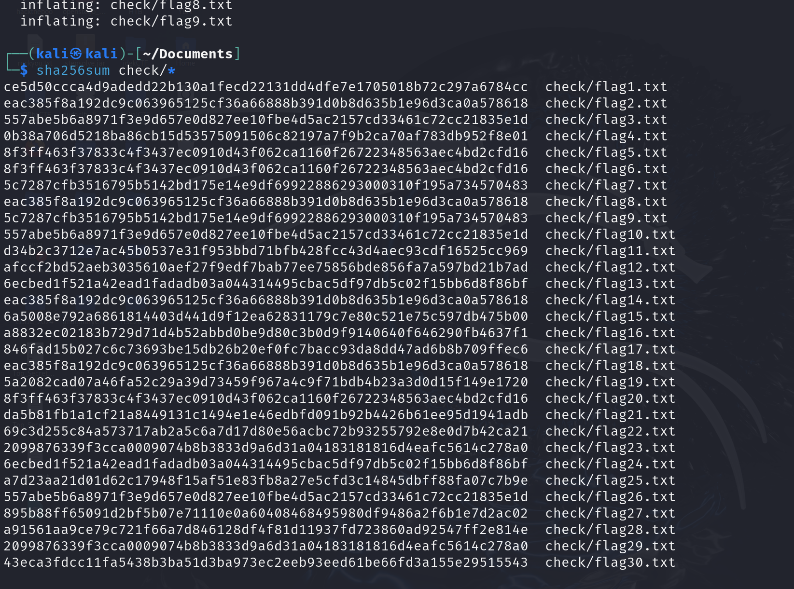
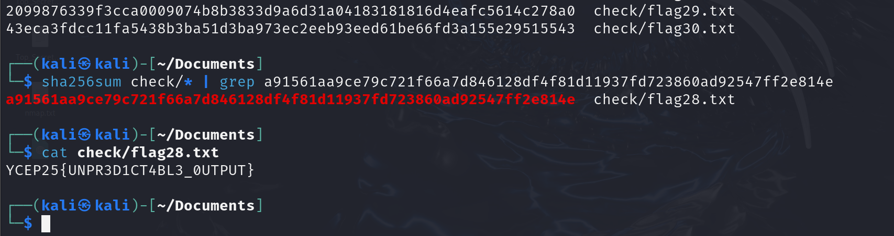

# Sum Checker

We are provided with a zip file, containing 30 files named flag<n>.txt.

After unzipping the zip file, we must find the file with a SHA256 checksum that matches the one given in the challenge: 
**Checksum of correct file:** `a91561aa9ce79c721f66a7d846128df4f81d11937fd723860ad92547ff2e814e`

To display the checksum of all 30 files in the `check` folder, we can run the following command:
```
sha256sum check/*
```



Out of the 30 files, 29 of them contain fake flags. To find the correct file, we can do:
```
sha256sum check/* | grep a91561aa9ce79c721f66a7d846128df4f81d11937fd723860ad92547ff2e814e
```

We now know that the file that contains the correct flag is flag28.txt.



We can cat the flag28.txt to obtain the flag.