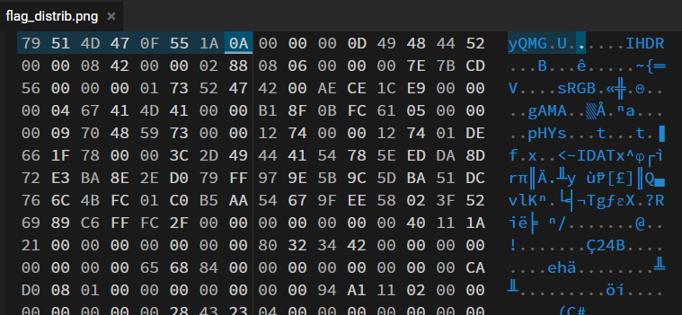

# Corrupt

For this challenge, we are given a damaged png file.
If we were to put this file into hexedit, we can see the file header is wrong...

The file header for a PNG file is `89 50 4E 47 0D 0A 1A 0A`

With the correct file header, we can obtain the flag `YCEP25{C0RrUpT_oR_n0T}`