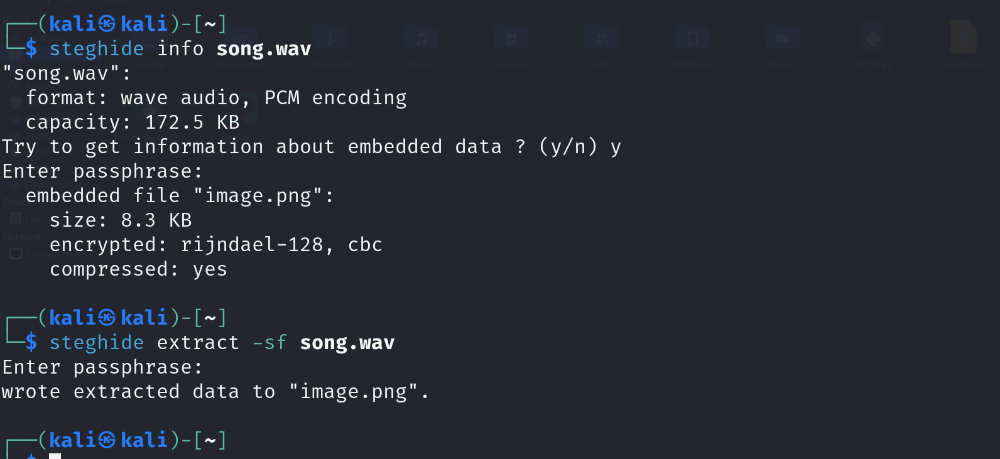
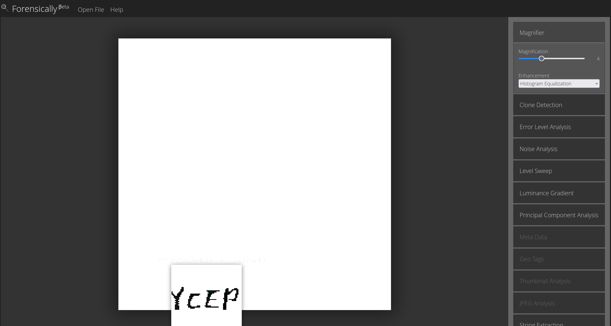
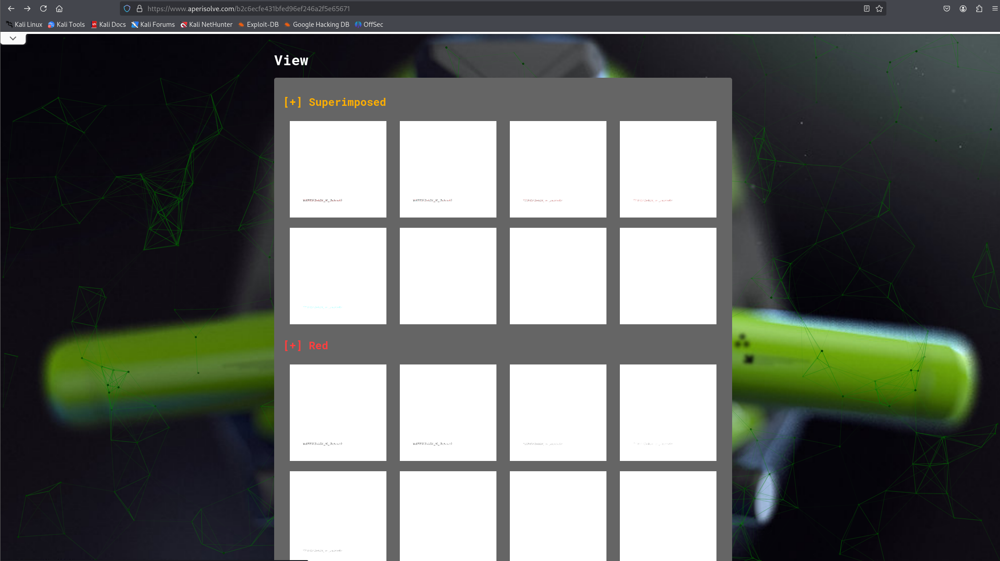
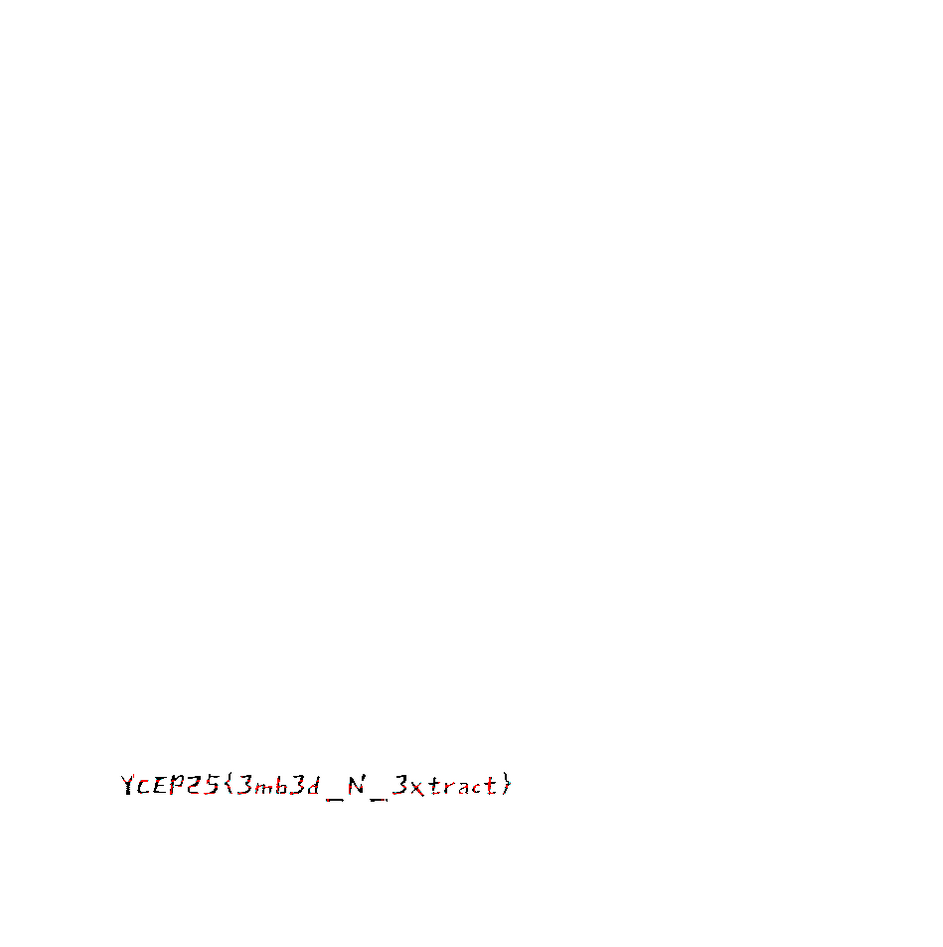

# Riding WAVes

Participants are only given 1 audio file `song.wav` for this challenge. They are expected to extract the embedded image file that was hidden in `song.wav` using steganography.



To do this, we can use `steghide` to view what the embedded files are. We can then use the following steghide command to extract the embedded `image.png` file:
```
steghide extract -sf song.wav
```

> [!NOTE]  
> There was no passphrase entered when the file was embedded using steghide. Hence when prompted for the passphrase, we do not need to input anything.

The extracted image looks like a plain white image. However, a very faint-looking flag can technically be seen in the bottom left corner of the image if we zoom in on the image.



We can use tools like Forensically to clearly view the flag.



Alternatively, we can input `image.png` in AperiSolve. Under the 'View' section of the results, we should be able to see some images with the flag clearly stated.



We can select any of them to see the full flag. Note that this flag is case-sensitive.
