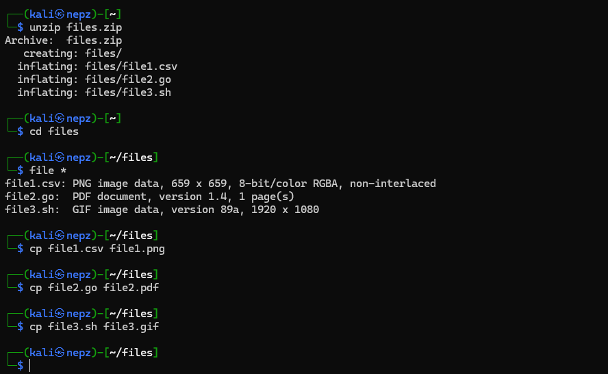
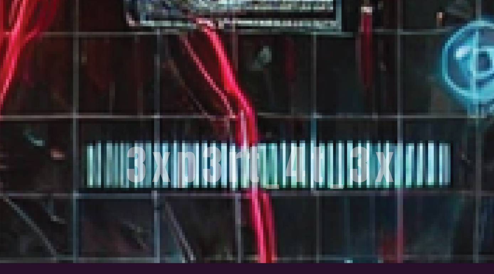

## Extensions

For this challenge, all we have to do is to change the file extensions to whatever they should be.

After unzipping the zip file, navigate into the extracted `files` directory and check the correct file types of the 3 files.

This can be done by running `file *`.

We will realise that we need to change the file extensions of the 3 files as follows:

- `file1.csv` → `file1.png`
- `file2.go` → `file2.pdf`
- `file3.sh` → `file3.gif`

Next, just open these files and read the respective parts of the flag.

Full flag should be `YCEP25{3xp3rt_4t_3xt3n510ns}`.