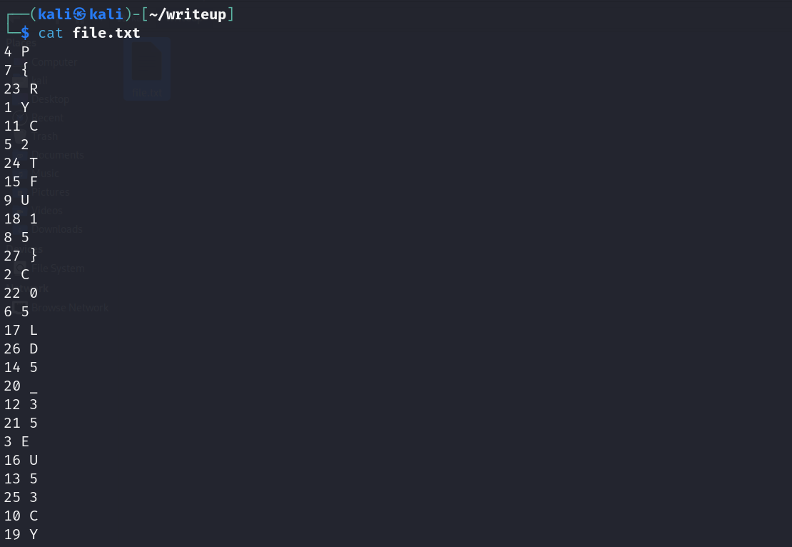
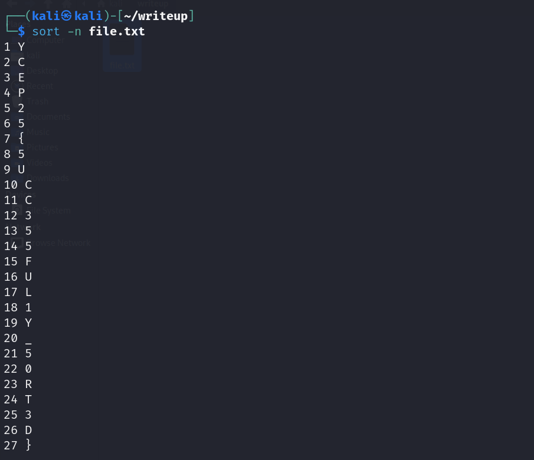
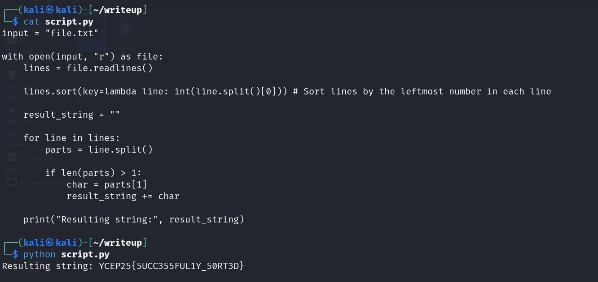

## Sort and Read

We are given a file `file.txt` with the randomly sorted contents.



The characters on the right represent the individual characters that form the flag, when sorted correctly.

They are all accompanied by a respective line number.



To sort them, we can run `sort -n file.txt`.



Alternatively, participants can (and should) explore scripting to display the flag in a single line.

Example python script:

```py
input = "file.txt"

with open(input, "r") as file:
    lines = file.readlines()

    lines.sort(key=lambda line: int(line.split()[0])) # Sort lines by the leftmost number in each line
    
    flag = "" 

    for line in lines:
        parts = line.split()
        
        if len(parts) > 1:  
            char = parts[1]
            flag += char 

    print("Flag:", flag)
```
