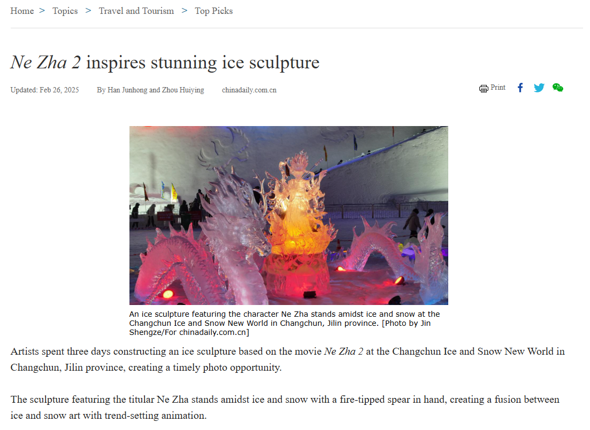

## Breaking Records

We are given an image file of a Nezha ice sculpture. Simply use Google reverse image search and check out the top results.

The image should match the one in this webpage. We can easily identify the city name (Changchun) and province (Jilin province) from the description.

The other search results should also provide similar information.