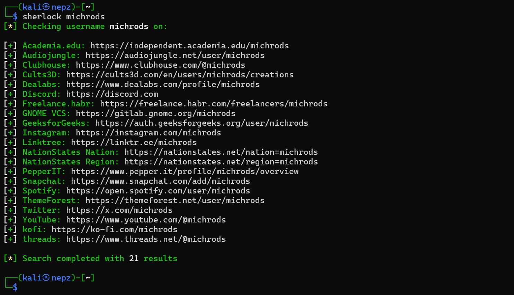
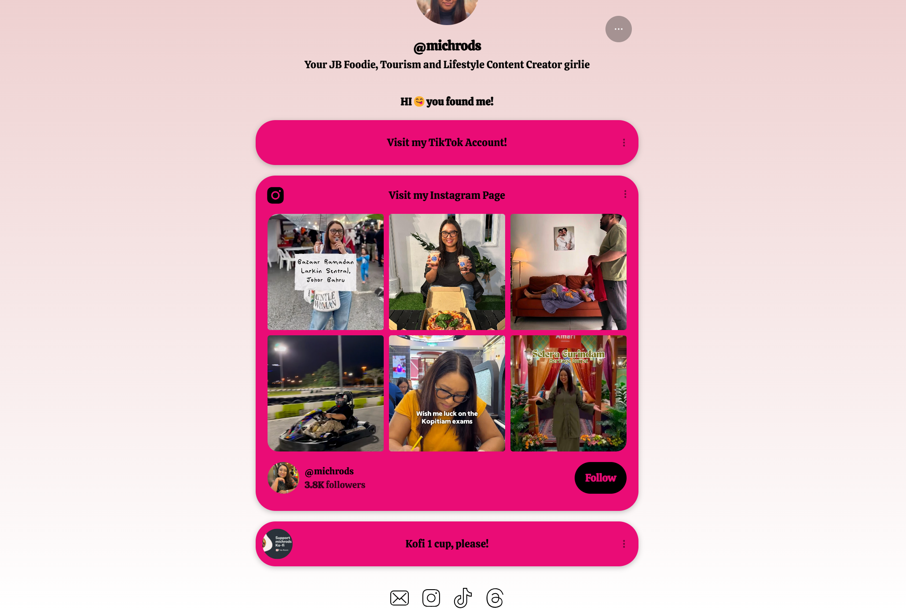
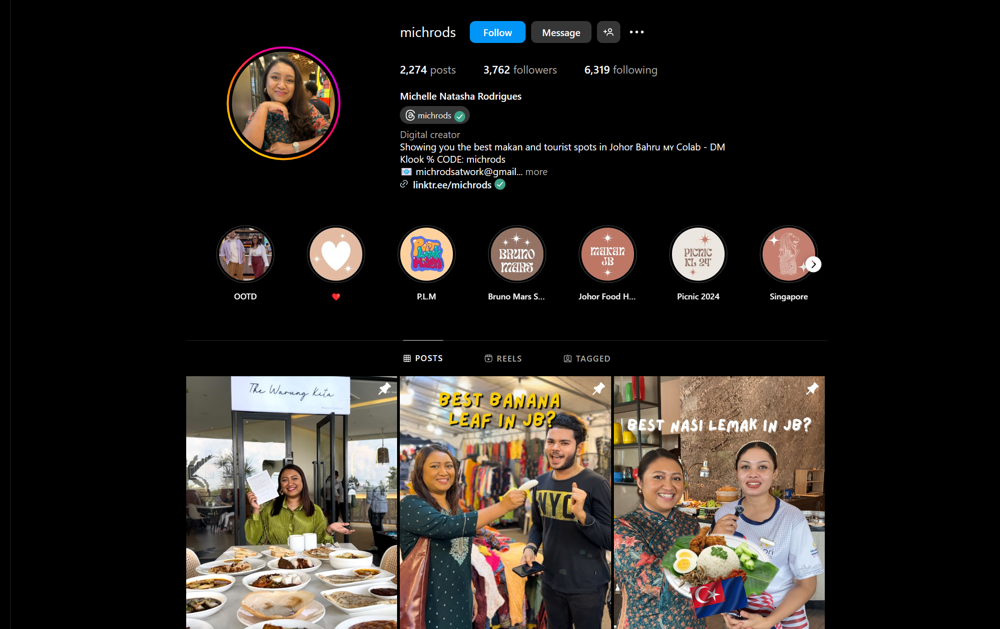
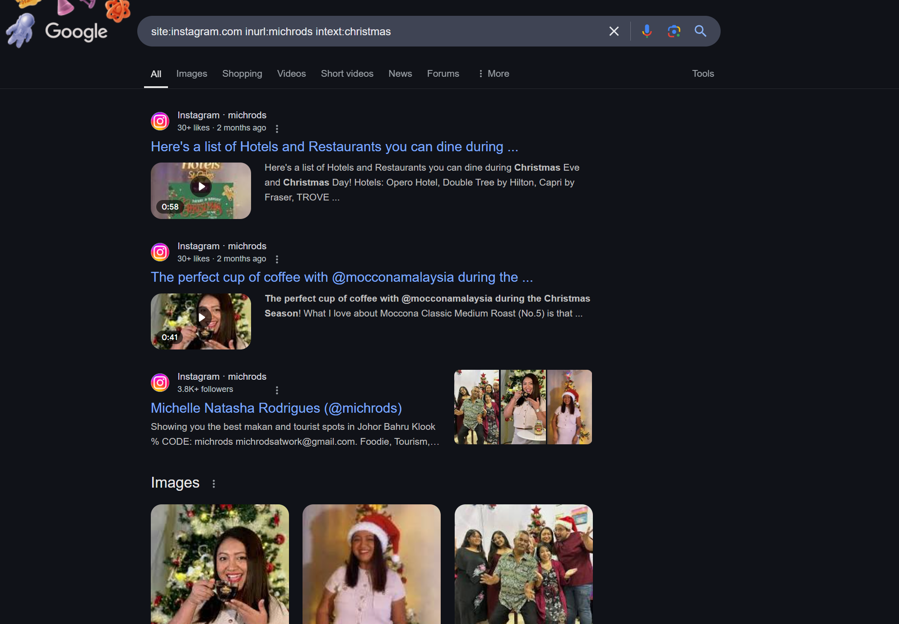
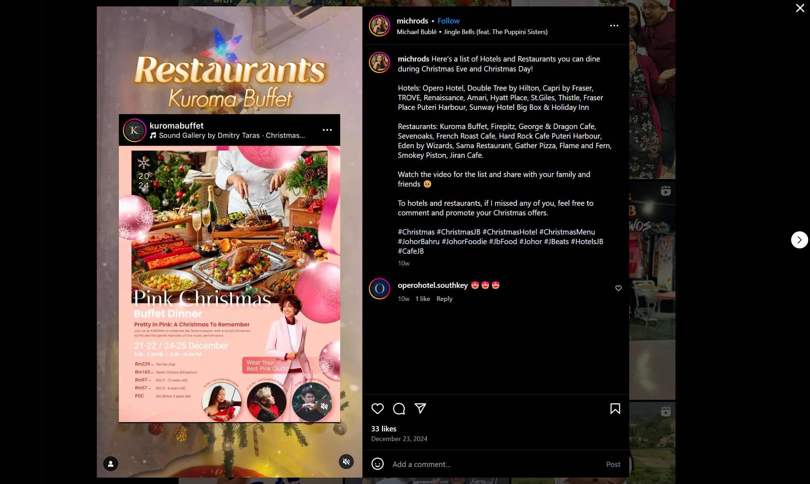
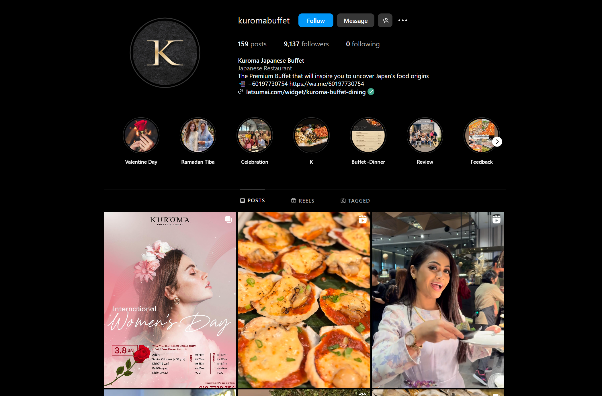
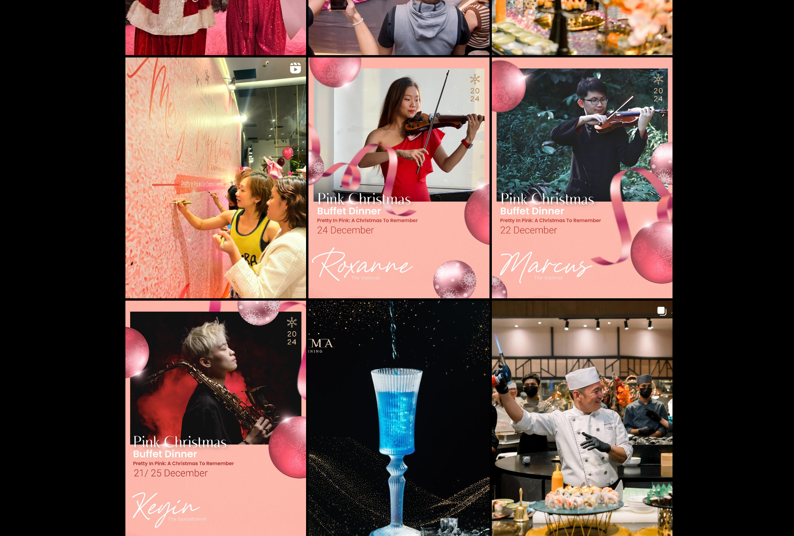
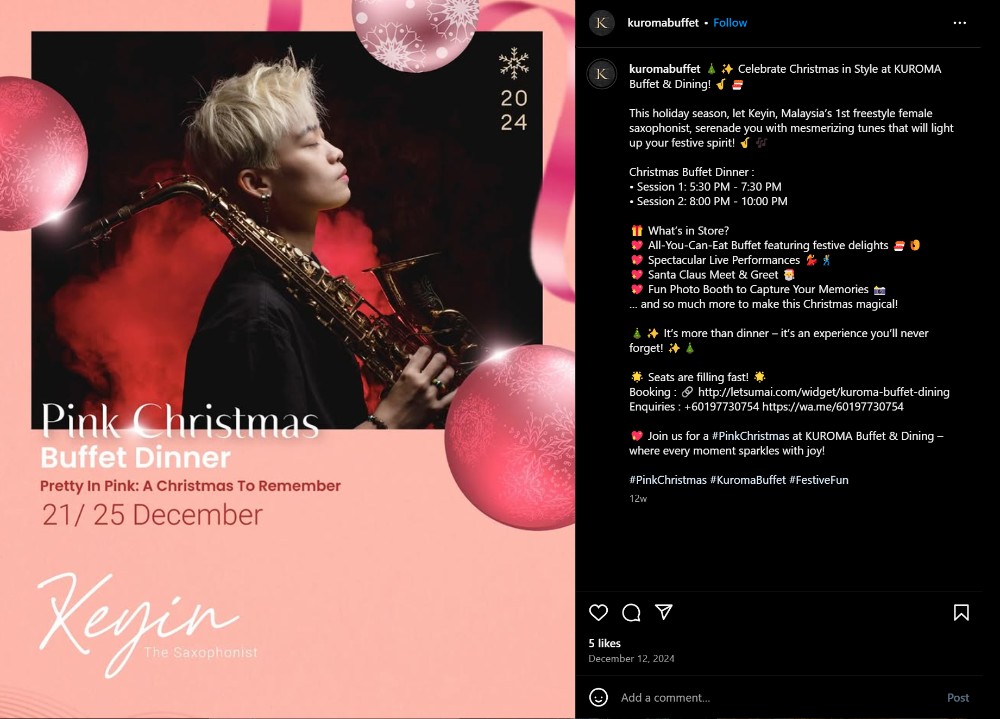
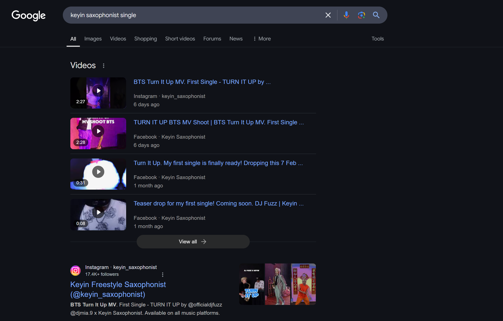

## Etched in memory

For this challenge, we are tasked to find a musician's stage name and their latest single.

>[!NOTE]
>
>From the description, we are expected to pick out certain clues like:
>
>- `Dining place` (Perhaps a restaurant)
>- `Johor Bahru, Malaysia` (Location)
>- `Live music performance`
>- `michrods` (Username of the person who recommended the place)
>- `Christmas` (Time period)
>- `Latest single` (Aforementioned musician has recently released a single)

1. To begin, we can check which platforms have users with the username `michrods`.



From the results, we know that the username has been used across several platforms. The person who recommended the place probably used mainstream social media platforms to post their recommendations, so we can zoom into results like `Instagram`, `Youtube`, and perhaps `threads`.

We can also try to check the Linktree of this person, as it may lead to certain findings.



We can see that the Linktree page stated that the user is a "JB Foodie". This confirms that this is the user we're looking for. In the Linktree, the person has featured their `TikTok` and `Instagram` pages.

2. We can proceed to check the `Instagram` page of this user. 



We see that the creator's `Instagram` bio states that her page features dining and tourist spots in JB, Malaysia as well, which means we're on the right track.

In fact, I've checked the `TikTok` page too, and it seems like this creator posts the same content on both social media platforms.

3. Since the challenge specifies that the event happened during the Christmas period, we can scroll down and check relevant posts that were posted by this creator during that time period.


One thing that should catch our attention is the post titled "Hotels & Restaurants to go during Christmas in Johor Bahru". 

4. We may even use a bit of Google Dorking to narrow our search.

A Google search query we can use is: 

```
site:instagram.com inurl:michrods intext:christmas
```



Observe that the specific post is returned as the first result.

5. We can proceed and check out the post highlighted above.



This posts features many advertisement posters of different hotels and food establishments, but there should be one that catches our eye: Kuroma Buffet's "Pink Christmas Buffet Dinner" event.

In the poster, there is a line that reads:

```
Join us at KUROMA to celebrate the festive season with a lavish Christmas buffet and the gentle melodies of live music performance
```

This may be hard to pick out due to the tiny font size, especially on mobile phone screens.

Thankfully, as hinted in the challenge, the place is described as a `dining place`, which should shift our attention to the `Restaurants` section in the post description as well. `Kuroma Buffet` is the first restaurant listed there.

6. After we have identified the restaurant as `Kuroma Buffet`, we can essentially use the same steps to find the musician.



We can first navigate to Kuroma Buffet's `Instagram page`, then scroll down to find the content posted during the Christmas period.



As stated in the advertisement poster, there are 3 musicians who will be performing at Kuroma Buffet restaurant during the "Pink Christmas Buffet Dinner" event.

However, the challenge description states that the performance happened on Christmas. There is only 1 musician performing on that day.

7. We can check out the content of this specific post.



We have identified the musician as `Keyin`. However, this is not her musician stage name. She goes by `Keyin Saxophonist` usually, and this can be easily found by searching her name on Google.

8. Now that we know the musician's stage name, there is just 1 last piece of the puzzle - Finding her latest single.



Her latest single should be "Turn It Up".

Piecing everything together, the flag will be `YCEP25{keyinsaxophonist_turnitup}`.