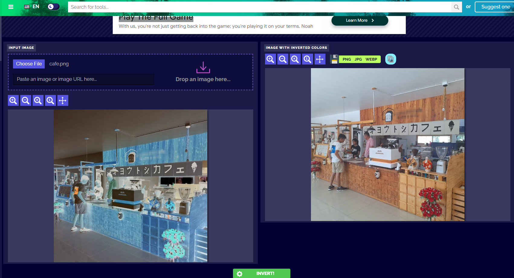
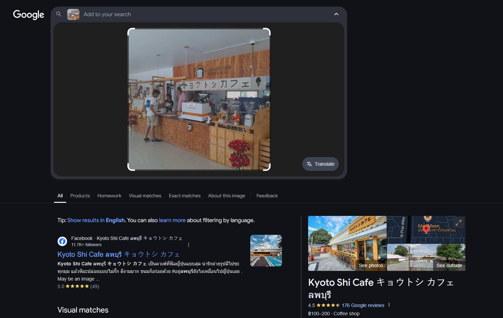
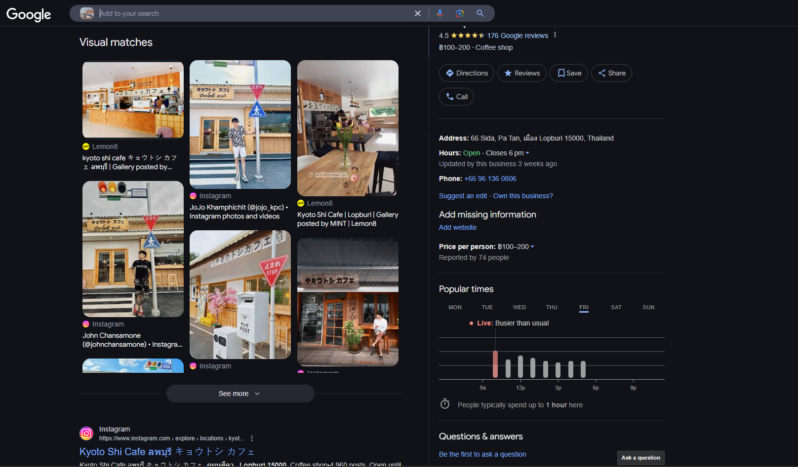
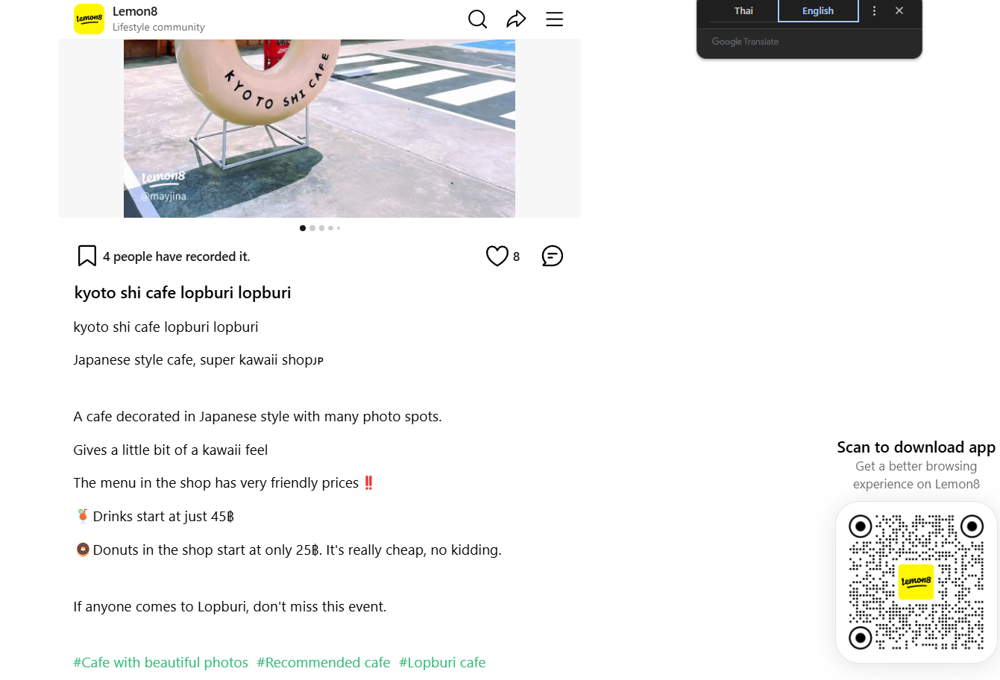
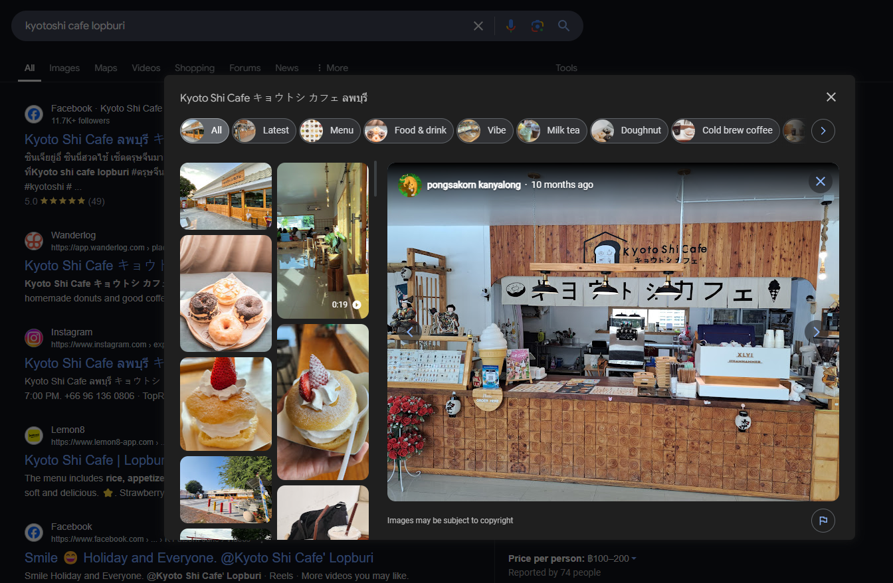

## Snips and Sips

The given file is an image with inverted image colours.

Before performing a Google reverse image search, the image colours should be inverted back to original. 

We can use any online image colours inverter tool to do this. Other methods should also produce the same result.

After we get the original image, perform a simple Google reverse image search.

There should be at least 1 result that matches our image, like the lemon8 one in the above image.

Clicking on the lemon8 result brings us to a post on lemon8. The description under this post is written in Thai, so we must first translate into English before reading it.

We can identify both the city name (lopburi) and the cafe name (Kyoto Shi Cafe) from the post description.

After doing a Google search, we can verify that our results are correct (Cafe interior matches the one in our original image).