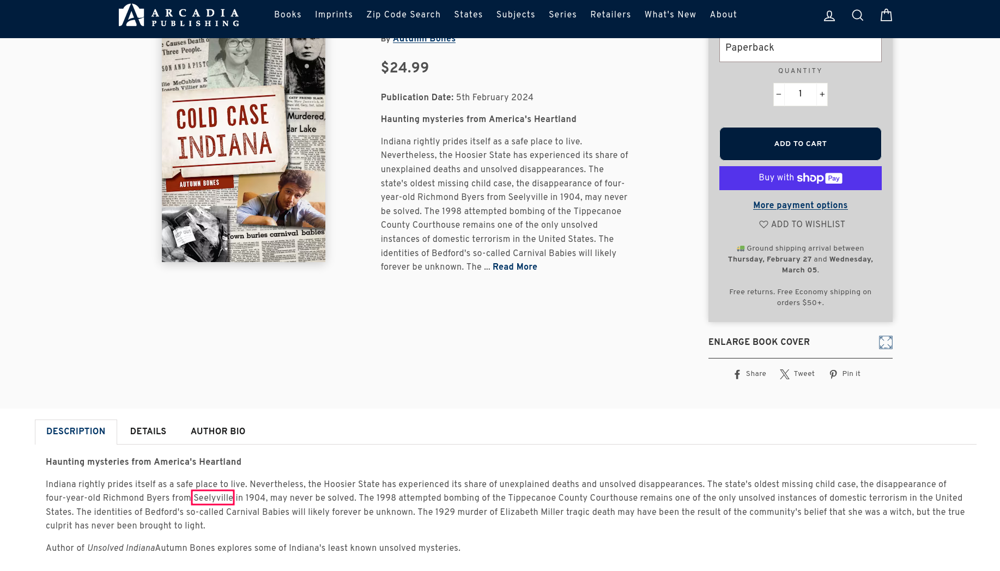
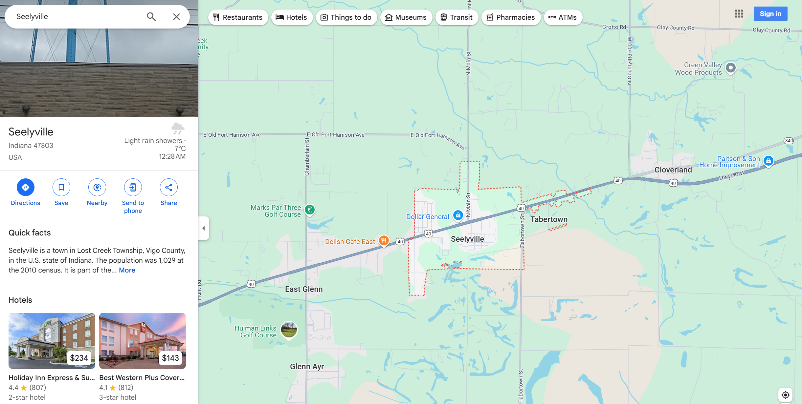
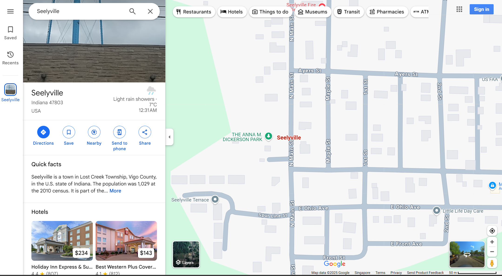
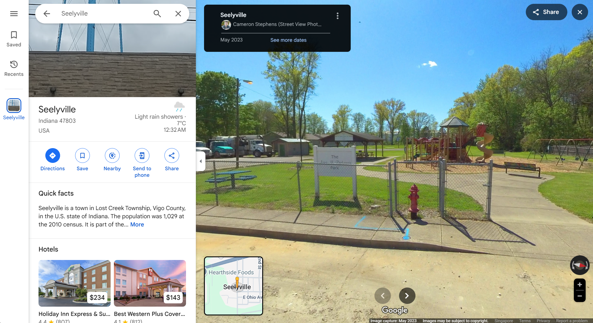

# Vanished Whispers

Participants are given an image called `casestudy.png`. Their task is to find the name of the park in the image that has been purposely obfuscated.

In the challenge description, it was mentioned that there was a missing child mystery case that happened in a town in Indiana, USA in the year 1904. Participants are expected to use this information to get the name of this town. 

This can be done with a simple Google search. Participants are free to choose any of the top search results to locate the name of the town, as they should all highlight it.

The above image is a screenshot showing a webpage from the 2nd search result. The name of the town we're looking for is `Seelyville`.

Participants are allowed to use any online maps of their choice (E.g. Baidu, Bing, Yandex, Google). The example shown here is using Google Maps.

We can zoom in and look around to locate the name of park that matches the picture provided (`casestudy.png`). The park name should be `The Anna M. Dickerson Park`.

We can make use of the Google Maps Live View feature to verify whether our findings are correct.

Flag: `YCEP25{THEANNAMDICKERSONPARK}`